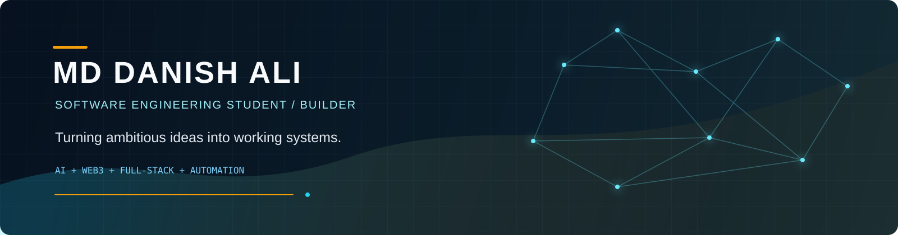
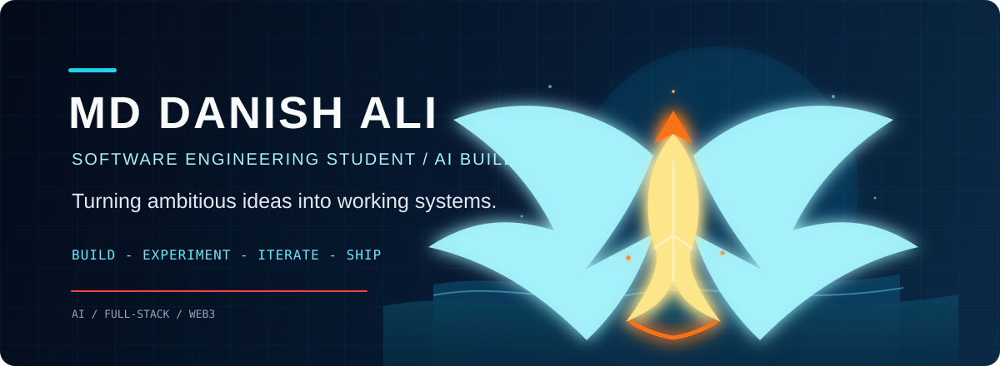

  

  
   
  <b>BUILD → ITERATE → SHIP</b>

### SOFTWARE ENGINEERING STUDENT · AI BUILDER · FULL-STACK · WEB3

**I turn ambitious ideas into working systems.**

AI × SOFTWARE × WEB3

 

## About

I'm **Md Danish Ali**, a software engineering student based in Bangalore. I like building practical products where the hard part is making several pieces work together: AI agents, automation, web applications, distributed workflows, or privacy-preserving identity. I learn by experimenting, joining hackathon-style builds, and shipping usable prototypes. The goal is simple: keep getting better at turning a rough idea into a system someone can actually try.

## Currently Building

| Project | What I'm exploring | Link |
| --- | --- | --- |
| **MilkyWay** | Supply-chain anomaly detection with deterministic checks, Gemini reasoning, Google ADK, MCP tools, BigQuery, and Firestore. | [Open repository](https://github.com/Danish26-dev/milkywayai) |
| **FRAB** | An evidence-backed financial investigation workflow with specialized agents, deterministic analysis, and human review. | [Open repository](https://github.com/Danish26-dev/FRAB-financial_crime_investigator) |
| **PrintX** | Natural-language document changes and privacy-aware print execution using AWS Bedrock and Strands agents. | [Open repository](https://github.com/Danish26-dev/PrintX) |
| **IdentiPI** | DID-based identity, Verifiable Credentials, and selective disclosure with Midnight ZK proofs. | [Open repository](https://github.com/Danish26-dev/IdentiPI) |

## Featured Builds

<table>
  <tr>
    <td width="50%" valign="top">
      <h3>IdentiPI</h3>
      
Privacy-first decentralized identity that turns documents into Verifiable Credentials and proves claims without exposing the underlying data.

      
<b>Midnight · Compact · ZKP · Veridian · React · Express · IPFS</b>

      <a href="https://github.com/Danish26-dev/IdentiPI">View project →</a>
    </td>
    <td width="50%" valign="top">
      <h3>PrintX</h3>
      
An autonomous printing workflow: user intent becomes agent planning, deterministic tool execution, printer output, and temporary-file cleanup.

      
<b>React · Tailwind · Node.js · Express · TypeScript · AWS Bedrock · Docker</b>

      <a href="https://github.com/Danish26-dev/PrintX">View project →</a>
    </td>
  </tr>
  <tr>
    <td width="50%" valign="top">
      <h3>ABIL</h3>
      
Middleware for two-way synchronization between the Karnataka Single Window System and legacy department systems, with policy-driven reconciliation and audit trails.

      
<b>React · Node.js · Express · Socket.IO · MongoDB · Strands SDK · AWS Bedrock</b>

      <a href="https://github.com/Danish26-dev/-ABIL-Agent-Based-Interoperability-Layer">View project →</a>
    </td>
    <td width="50%" valign="top">
      <h3>Artic</h3>
      
Multi-agent contract intelligence for clause extraction, risk analysis, scenario simulation, and safer negotiation language.

      
<b>React · Tailwind · FastAPI · Python · Gemini 2.5 Flash · MongoDB · Twilio</b>

      <a href="https://github.com/Danish26-dev/Artic-Multi-Agent-Contract-Intelligence">View project →</a>
    </td>
  </tr>
  <tr>
    <td width="50%" valign="top">
      <h3>CoCoach</h3>
      
A multimodal virtual coach combining camera-based pose estimation, wearable signals, adaptive training logic, and a 3D avatar.

      
<b>React · Node.js · Express · Computer Vision · Pose Estimation · Smartwatch APIs</b>

      <a href="https://github.com/Danish26-dev/CoCoach">View project →</a>
    </td>
    <td width="50%" valign="top">
      <h3>Eduflix</h3>
      
An AI learning pipeline that turns a topic into a story, Manim animation, rendered video, and quiz through n8n orchestration.

      
<b>React · Tailwind · n8n · Manim · Python · FFmpeg · Firebase / Supabase</b>

      <a href="https://github.com/Danish26-dev/Eduflix">View project →</a>
    </td>
  </tr>
</table>

## AI & Intelligent Systems

I build AI as part of a system, not as a standalone chatbot. Recent work includes:

- **Agent orchestration:** specialized agents, supervisors, deterministic tools, and human-in-the-loop review.
- **Evidence-grounded workflows:** MilkyWay and FRAB separate measurable signals from model reasoning and keep an audit trail.
- **Generative pipelines:** Eduflix turns educational topics into stories, animation, video, and quizzes through automation.
- **Document intelligence:** PrintX handles document instructions and controlled execution; Artic analyzes contracts at clause level.
- **AI platforms:** AWS Bedrock, Strands SDK, Gemini, Google ADK, Vertex AI, and MCP appear across current projects.

## Blockchain & Web3

I'm exploring decentralized systems by building practical identity and privacy flows. **IdentiPI** combines Veridian-based DID and VC concepts with Midnight Compact contracts and zero-knowledge proofs for selective disclosure. It is a working exploration of how users can prove a claim without handing over an entire document, not a claim of blockchain expertise.

## Hackathons & Building Under Constraints

Hackathons are a useful forcing function: define the problem, make the architecture legible, and get a working demo in front of people quickly.

- **IdentiPI:** a Midnight-focused privacy-preserving identity build.
- **ABIL:** a PAN IIT AI for Bharat Hackathon project around two-way interoperability for government systems.
- **FRAB:** built for the Smart Horizon 2026 48-hour challenge on autonomous financial investigation.
- **Eduflix:** a hackathon-ready learning product built around an n8n-generated content pipeline.

## Technology

**Languages**

  

**Frontend & Backend**

    

**AI, Data & Automation**

    

**Web3, Cloud & Delivery**

   

## GitHub Snapshot

  
  

  

 

### BUILD · EXPERIMENT · SHIP

[GitHub](https://github.com/Danish26-dev) · [LinkedIn](https://www.linkedin.com/in/md-danish-ali-dev/)

